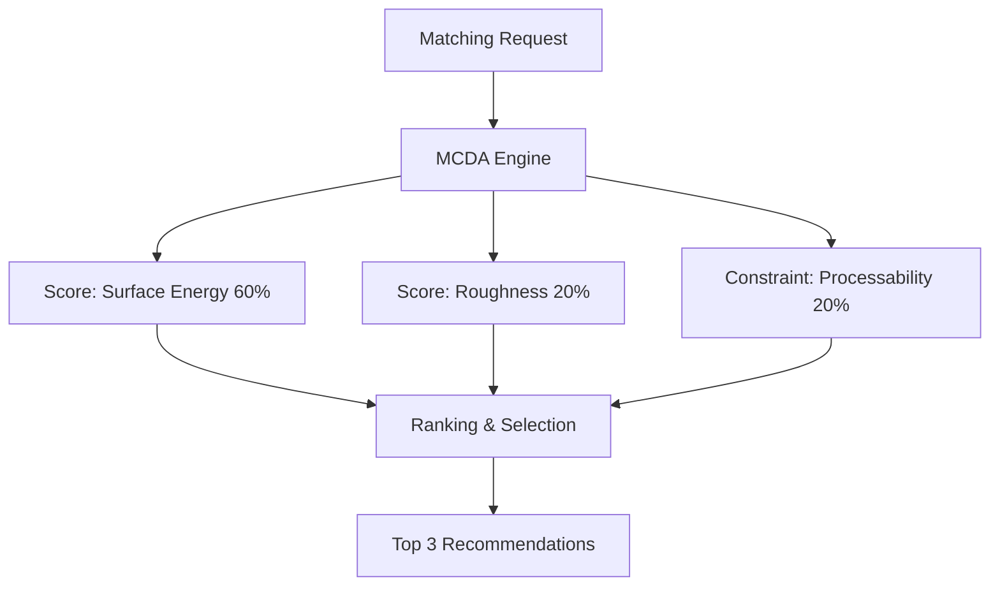

# 제품 DB 매칭 엔진 (SG_proj_012)

## 1. 개요
MCDA(AHP/TOPSIS) 기반 다중 목적 최적화 기법을 사용하여 기성 제품을 추천하는 엔진입니다.

## 2. 시스템 아키텍처

## 3. 기술 스택
- Backend: FastAPI, Python 3.10
- Algorithm: AHP / TOPSIS

## 4. 참조 문서
- ADR-0001

---
*Updated by System: 2026-06-29 (Resolved 260627 Analysis Report priority issues)*