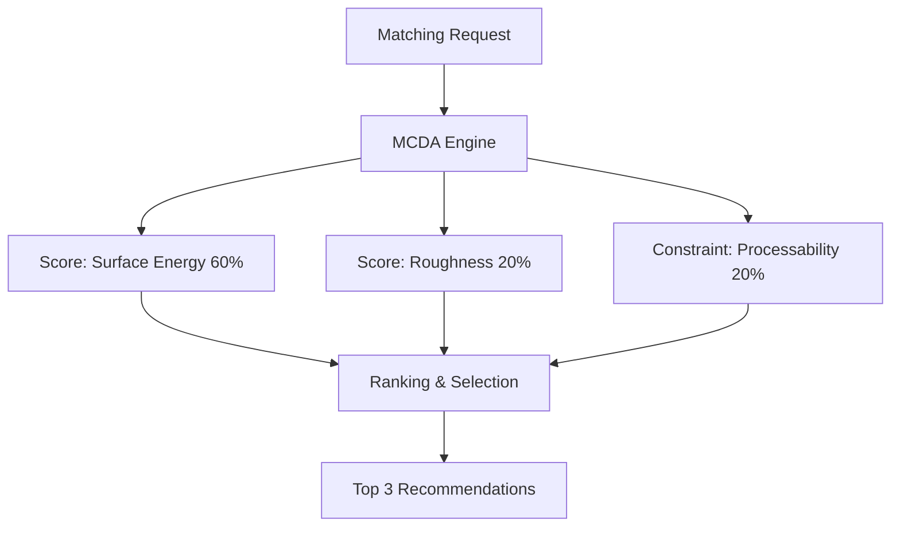

# 제품 DB 매칭 엔진 (SG_proj_012)

## 1. 개요
MCDA(AHP/TOPSIS) 기반 다중 목적 최적화 기법을 사용하여 기성 제품을 추천하는 엔진입니다.

## 2. 시스템 아키텍처

## 3. 기술 스택
- Backend: FastAPI, Python 3.10
- Algorithm: AHP / TOPSIS

## 4. 참조 문서
- ADR-0001

---
## 5. 알려진 한계 및 추후 보정 과제 (Known Limitations & Future Adjustments)
- 현재 제품 매칭 알고리즘(matcher.py) 내 점수 가중치(표면에너지 0.6, 조도 0.2, 가공성 0.2) 및 특성별 오차 보정 상수(표면에너지 2, 조도 20, 가공 가혹도 10)는 초기 정합성 유도를 위해 임의로 하드코딩된 휴리스틱(Heuristic) 상수입니다.
- 추후 실측 데이터와 필드 테스트 결과를 확보하여, AHP/TOPSIS 다기준 의사결정 모델에 부합하는 일관성 지수 및 객관적인 가중치 도출 수식으로 전면 대체할 예정입니다.

---
*Updated by System: 2026-06-29 (Resolved 260627 Analysis Report priority issues)*

---
*Updated by System: 2026-06-29 (Matching DB Integration Completed)*
## 최신 업데이트 내역 (2026-07-05)
- [CI/CD]: 통합 E2E 테스트 검사 통과 및 전체 모듈 연동 보고서 발간 완료.
- [loguru 로깅 통합]: 표준 logging 및 print 구문을 loguru.logger 기반으로 일원화하여, 매칭 알고리즘 시작 시점 및 Top 3 추천 선정 완료 단계를 체계적으로 수집하도록 개선함.
- [의존성 추가]: pyproject.toml dependencies 내에 loguru>=0.7.0 명세를 정식 추가함.
