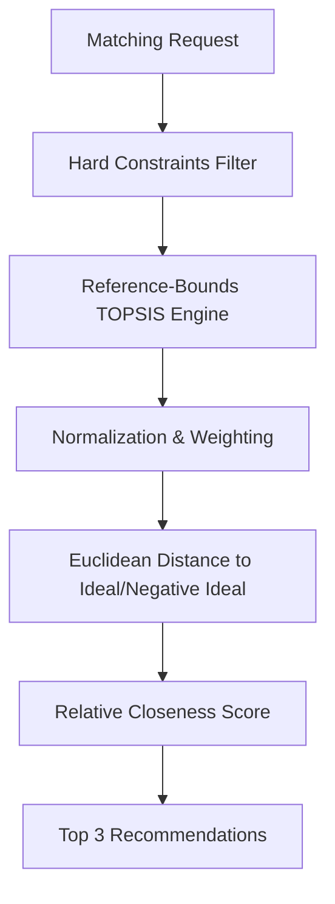

# 제품 DB 매칭 엔진 (SG_proj_012)

## 1. 개요
다기준 의사결정(MCDA) 방식인 TOPSIS(Technique for Order of Preference by Similarity to Ideal Solution) 기법을 사용하여 기성 제품을 추천하는 엔진입니다.

## 2. 시스템 아키텍처

```mermaid
graph TD
    A[Matching Request] --> B[Hard Constraints Filter]
    B --> C[Reference-Bounds TOPSIS Engine]
    C --> D[Normalization & Weighting]
    D --> E[Euclidean Distance to Ideal/Negative Ideal]
    E --> F[Relative Closeness Score]
    F --> G[Top 3 Recommendations]
```

## 3. 핵심 동작 방식 (Reference-Bounds TOPSIS)
- **후보 필터링**: 가공성 수준 등 물리적 제약을 충족하지 못하는 제품은 1차로 필터링됩니다.
- **절대적 기준 스케일링**: 현재 데이터베이스 내의 제품군끼리 상대적으로 정규화(Vector Normalization)를 수행할 경우 발생하는 순위 역전(Rank Reversal) 현상을 방지하기 위해, 사전 정의된 절대적 허용 한계(`reference_bounds`)를 기준으로 0~1 정규화를 수행합니다.
- **최종 점수**: 각 속성별 가중치가 적용된 유클리디안 거리(이상해/부정해)를 기반으로 산출된 Relative Closeness(%)를 최종 추천 점수로 반환합니다.

## 4. 가중치 튜닝 (Offline Optimizer)
- `scripts/optimize_weights.py`를 통해 성공적인 매칭 이력(Ground Truth)을 모사하여, 최적의 가중치를 자동 산출합니다.
- 특정 속성에 점수가 과도하게 편향되는 것을 방지하기 위해 각 가중치에 최소/최대 제약(bounds)을 두고 `scipy.optimize.minimize` 로직이 구동됩니다.
- 도출된 가중치 및 설정값은 `src/core/config.json`에서 관리됩니다.

## 5. 기술 스택
- Backend: FastAPI, Python 3.10
- Algorithm: Reference-Bounds TOPSIS
- Optimization: SciPy (SLSQP)

## 6. 참조 문서
- ADR-0001

---
*Last Updated: 2026-08-02 (MCDA Refactoring & Offline Optimizer)*
